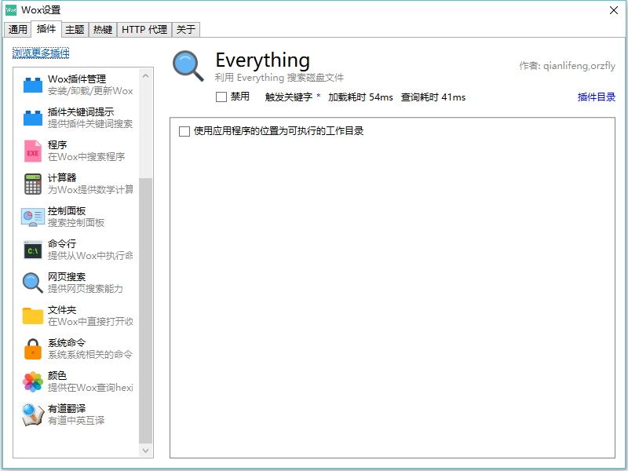

# 【持续更新】小工具推荐

我们在使用计算机的过程中，总会有各种各样的需求，也许是为了颜值，也许是为了工作效率，有或是为了方便。这些需求系统本身没有提供相应的功能，或者系统提供的功能并不是那么好用。我们就渴望找一个好的工具代替。  
本更新列表推荐工具的优先级：**开源**、**免费**、**多平台**、**绿色**  
[Toc]

## Atom 编辑器

官方描述：Atom is a text editor that's modern, approachable, yet hackable to the core—a tool you can customize to do anything but also use productively without ever touching a config file.    

Sublime text有的功能它都有。但是它的配置文件在用户目录下，即使是免安装版，包什么的也在用户目录下。尽管插件包位置可以更改，但是配置文件不能更改。可以使用``sycn-setting``插件备份到GitHub上。但是，要重新安装的时候，需要下载这些包，由于我国国情原因，可能会出现网络问题。
  
看这篇：[GITHUB开源编辑器ATOM](http://www.pinnsvin.cn/wordpress/2016/05/20/github%E5%BC%80%E6%BA%90%E7%BC%96%E8%BE%91%E5%99%A8atom/) 

安装文件大小：``178MB``  
官网地址：[Atom官网](https://atom.io/)  
GitHub地址：[atom/atom](https://github.com/atom/atom)  
推荐理由：**功能强大**、**开源免费**、**多平台**、**GitHub出品**、**中文支持**  
推荐指数：``⭐⭐⭐⭐⭐``

## Sublime Text 编辑器

比较Atom的话，比较小，安装包只有8MB左右，如果是免安装版，配置文件等相关文件在它自己的目录下，便于携带，方便备份。但是这个软件是收费的，价格70刀。  

安装文件大小：``8MB``  
官网地址：https://www.sublimetext.com  
推荐理由：**小巧**、**便携**、**多平台**、**中文支持**  
推荐指数：``⭐⭐⭐⭐``

## FreeMind 思维导图

这是一款思维导图编辑软件。

貌似没有官网。 

安装文件大小：``30MB``  
下载地址：http://freemind.sourceforge.net/wiki/index.php/Download  
推荐理由：**功能强大**、**免费**、**多平台**、**小巧**、**中文支持**  
推荐指数：``⭐⭐⭐⭐⭐``

## Diagram Designer 流程图编辑  

汉化需要下载中文语言包。  
安装文件大小：``30MB``  
下载地址：http://meesoft.logicnet.dk/DiagramDesigner/  
推荐理由：**功能强大**、**免费**、**小巧**、**中文支持**  
推荐指数：``⭐⭐⭐⭐⭐``

## Snipaste 截图工具

Snipaste 是一个简单但强大的截图工具，也可以让你将截图贴回到屏幕上！下载并打开 Snipaste，按下 F1 来开始截图，再按 F3，截图就在桌面置顶显示了。就这么简单！

你还可以将剪贴板里的文字或者颜色信息转化为图片窗口，并且将它们进行缩放、旋转、翻转、设为半透明，甚至让鼠标能穿透它们！如果你是程序员、设计师，或者是大部分工作时间都在电脑前，贴图功能将改变你的工作方式、提升工作效率。

Snipaste 是免费软件，它也很安全，没有广告、不会扫描你的硬盘、更不会上传用户数据，它只做它应该做的事。

安装文件大小：``12MB``  
官网：https://zh.snipaste.com/  
推荐理由：**功能强大**、**免费**、**小巧**、**中文支持**  
推荐指数：``⭐⭐⭐⭐⭐``

## Everything 文件查找

查找文件速度非常快。

安装文件大小：``1.4MB``  
官网：http://www.voidtools.com/  
推荐理由：**功能强大**、**免费**、**小巧**、**中文支持**  
推荐指数：``⭐⭐⭐⭐⭐``

## ScreenTogif gif录屏软件

上边软件的演示图都是用它录的，可以存为视频，图片，GIF。质量非常高，支持逐帧编辑、图片水印等。

白板录制

菜单

安装文件大小：2.7MB  
OS:windows  
官网：http://www.screentogif.com/  
GitHub：https://github.com/NickeManarin/ScreenToGif   
推荐理由：**功能强大**、**开源免费**、**小巧**、**中文支持**  
推荐指数：⭐⭐⭐⭐⭐

## Fences 桌面整理

  

30天试用。  
安装文件大小：``8MB``  
OS：``windows``  
价格：``9.9刀-49.9刀``  
官网：http://www.stardock.com/products/fences/  
Steam：http://store.steampowered.com/app/607380/Fences/  
推荐理由：**操作简单**、**整理桌面**、**小巧**  
推荐指数：``⭐⭐⭐``

## Rainmeter 桌面美化

非常非常强大，需要动手能力强。但是玩游戏的时候最好关闭，不关的话会掉帧。

安装文件大小：``8MB``  
OS：``windows``   
官网：https://www.rainmeter.net/  
GitHub：https://github.com/rainmeter/rainmeter  
主题包下载：
https://bbs.rainmeter.cn/(需要注册，3RMB)  
官方推荐主题下载地址：https://www.rainmeter.net/discover  
推荐理由：**功能强大**、**桌面美化**、**开源免费**  
推荐指数：``⭐⭐⭐⭐⭐``

## WOX  启动器

国人开发的一款启动器，在GitHub上开源，文件查找，启动程序，网页搜索，支持cmd命令输入，python输入等。支持拓展插件，支持主题自定义。可以说是非常优秀，非常有效地提高工作效率。  
**使用ALT+空格快捷键激活。**

安装文件大小：``5.77MB``   
OS:``Windows``   
官网:http://www.getwox.com/    
GitHub:https://github.com/Wox-launcher/Wox    
推荐理由:**高效工具**、**开源免费**  
推荐指数:``⭐⭐⭐⭐⭐``  
