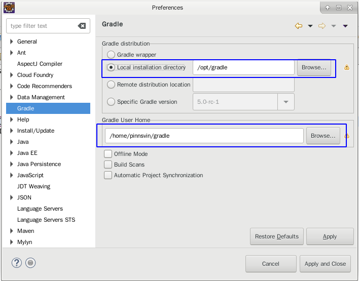
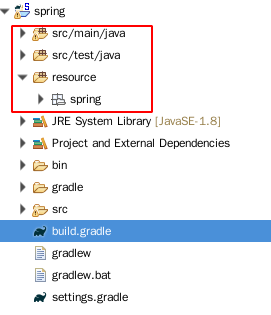

# gradle在Eclipse中的一些配置及使用

> 使用gradle做java开发的版本控制工具。以及在eclipse中的一些配置使用。本文不包含gradle以及eclipse插件的下载安装，只简单记录在eclipse中的少许配置以及在项目使用中的配置。

## 1. 在Eclipse中的配置
下载安装了gradle的插件之后，应该在eclipse中配置本地gradle的安装目录和本地仓库路径。如果不配置本地gradle安装路径的话，eclipse会自动去下载最新版gradle，没有没有设置代理，会出现一直一直同步的提示。建议还是安装之后配置本地安装路径。具体如下：


## 2. 项目中的``build.gradle``文件
> ``build.gradle``文件是项目中gradle的配置文件，主要配置gradle的一些插件、项目依赖、构建设置、文件路径等。
* 依赖管理
````gradle
dependencies {
    //配置项目依赖信息
}
````

* 插件
````gradle
plugins {
    id 'java-library'
    id 'eclipse'
}
````

* 远程仓库地址
````gradle 
repositories {
    maven { url 'http://maven.aliyun.com/nexus/content/groups/public/' }
    maven{ url 'http://maven.aliyun.com/nexus/content/repositories/jcenter'}
    jcenter()
}
````

* 统一管理版本号
> 在文件中创建``ext{}``
````gradle
ext {
	springVersion = "4.3.20.RELEASE"
	mockitoVersion = "1.10.19"
	aspectjweaverVersion = "1.9.2"
}
````
> 使用
````gradle
compile group: 'org.springframework', name: 'spring-core', version: rootProject.ext.springVersion
````

* 项目文件结构(classpath中的文件)  
````gradle
sourceSets {
	main {
		java {
			srcDir "src/main/java"
		}
		resources {
			srcDir "resource"
		}
	}
	test {
		java {
			srcDir "src/test/java"
		}
		resources {
			srcDir "resource"
		}
	}
}
````


* 默认output路径
````gradle
eclipse.classpath.defaultOutputDir = file("bin/default")
````


