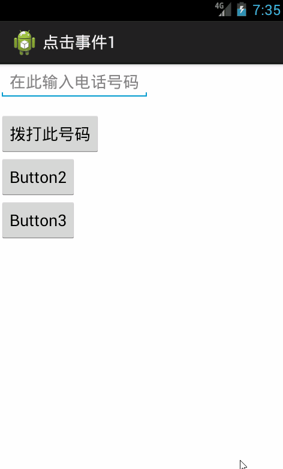

# Android-java中点击事件的四种写法

标签分类：android code

点击事件的必备条件：实现``OnClickListener``接口，重写``onclick(View v)``方法  
以拨号简单案例为例，如下图效果：  


逻辑流程：  

> 1.  获取点击对象，获取数据
> 2.  给对象设置监听类
> 3.  实现``OnClickListener``接口,重写``onClick(View v)``方法  

``onClick(View v)``逻辑：  

> 1.  获取输入内容：使用``EditText``对象的``getText()``方法，该方法返回值为``Editable``，需要用``toString()``转换成``String``类型
> 2.  判断输入是否为空，``TextUtils.isEmpty(str)``方法判断字符串``str``是否为空
> 3.  为空则提示``号码不能为空``，使用``Toast.makeText(MainActivity.this, "号码不能为空", Toast.LENGTH_SHORT).show();``,
``Toast makeText (Context context, CharSequence text, int duration)``返回值为Toast，参数列表（Context对象，提示内容，显示时长）

> 4.  如果不为空，``new ``一个``Intent``对象，使用``Intent``对象的``setAction(String action)``方法设置动作，使用``Intent``对象的``setData(Uri uriData)``方法设置数据。``startActivity(Intent intent)``方法启动Activity。

*注：应该在程序清单文件AndroidManifest.xml中添加``<uses-permission android:name="android.permission.CALL_PHONE"/>``，拨打电话时，美国紧急电话不会直接拨打*

三种方法：第四种不推荐，前三种酌情使用


## 1. 内部实现类

布局文件：activity_main.xml

````
<RelativeLayout xmlns:android="http://schemas.android.com/apk/res/android"
xmlns:tools="http://schemas.android.com/tools"
android:layout_width="match_parent"
android:layout_height="match_parent"
tools:context="${relativePackage}.${activityClass}" >


    <EditText
        android:id="@+id/editText1"
        android:layout_width="wrap_content"
        android:layout_height="wrap_content"
        android:focusable="true"
        android:focusableInTouchMode="true"
        android:hint="在此输入电话号码">

    </EditText>

    <Button
        android:id="@+id/button1"
        android:layout_width="wrap_content"
        android:layout_height="wrap_content"
        android:layout_below="@+id/editText1"
        android:layout_marginTop="14dp"
        android:text="拨打此号码" />

    <Button
        android:id="@+id/button2"
        android:layout_width="wrap_content"
        android:layout_height="wrap_content"
        android:layout_alignParentLeft="true"
        android:layout_below="@+id/button1"
        android:text="Button2" />

    <Button
        android:id="@+id/button3"
        android:layout_width="wrap_content"
        android:layout_height="wrap_content"
        android:layout_alignParentLeft="true"
        android:layout_below="@+id/button2"
        android:text="Button3" />


</RelativeLayout>
````

MainActivity.java

````
package com.example.onclick1;

import android.app.Activity;
import android.content.Intent;
import android.net.Uri;
import android.os.Bundle;
import android.os.storage.OnObbStateChangeListener;
import android.text.TextUtils;
import android.view.Menu;
import android.view.MenuItem;
import android.view.View;
import android.view.View.OnClickListener;
import android.widget.Button;
import android.widget.EditText;
import android.widget.Toast;

public class MainActivity extends Activity {

	private EditText editText;
	@Override
	protected void onCreate(Bundle savedInstanceState) {
		super.onCreate(savedInstanceState);
		setContentView(R.layout.activity_main);
		editText = (EditText) findViewById(R.id.editText1);
		Button button1 = (Button) findViewById(R.id.button1);
		Button button2 = (Button) findViewById(R.id.button2);
		Button button3 = (Button) findViewById(R.id.button3);

		//设置监听类
		button1.setOnClickListener(new MyOnClickListener());
		button2.setOnClickListener(new MyOnClickListener());
		button3.setOnClickListener(new MyOnClickListener());
	}
	private class MyOnClickListener implements OnClickListener{

		@Override
		public void onClick(View v) {
			int i = v.getId();
			switch (i) {
			case R.id.button1:
				String number = editText.getText().toString();
				if (TextUtils.isEmpty(number)) {
					Toast.makeText(MainActivity.this, "号码不能为空", Toast.LENGTH_SHORT).show();
				}else {
					Intent intent = new Intent();
					intent.setAction(intent.ACTION_CALL);
					Uri data = Uri.parse("tel:"+number);
					intent.setData(data);
					startActivity(intent);
				}

				break;
			case R.id.button2:
				Toast.makeText(MainActivity.this, "你点击了Button2", Toast.LENGTH_SHORT).show();
				break;
			case R.id.button3:
				Toast.makeText(MainActivity.this, "你点击了Button3", Toast.LENGTH_SHORT).show();
				break;
			}
		}

	}
}
````


## 2. 内部匿名类
MainActivity.java

````
package com.example.onclick1;

import android.app.Activity;
import android.content.Intent;
import android.net.Uri;
import android.os.Bundle;
import android.os.storage.OnObbStateChangeListener;
import android.text.TextUtils;
import android.view.Menu;
import android.view.MenuItem;
import android.view.View;
import android.view.View.OnClickListener;
import android.widget.Button;
import android.widget.EditText;
import android.widget.Toast;

public class MainActivity extends Activity {

	private EditText editText;
	@Override
	protected void onCreate(Bundle savedInstanceState) {
		super.onCreate(savedInstanceState);
		setContentView(R.layout.activity_main);
		editText = (EditText) findViewById(R.id.editText1);
		Button button1 = (Button) findViewById(R.id.button1);
		Button button2 = (Button) findViewById(R.id.button2);
		Button button3 = (Button) findViewById(R.id.button3);

		//设置监听类
		button1.setOnClickListener(new OnClickListener() {

			@Override
			public void onClick(View v) {
				String number = editText.getText().toString();
				if(TextUtils.isEmpty(number)){
					Toast.makeText(MainActivity.this, "[内部匿名类]号码不能为空", Toast.LENGTH_SHORT).show();
				}else{
					Intent intent = new Intent();
					intent.setAction(intent.ACTION_CALL);
					intent.setData(Uri.parse("tel:"+number));
					startActivity(intent);
				}
			}
		});
		button2.setOnClickListener(new OnClickListener() {

			@Override
			public void onClick(View v) {
				Toast.makeText(MainActivity.this, "[内部匿名类]你点击了Button2", Toast.LENGTH_SHORT).show();
			}
		});
		button3.setOnClickListener(new OnClickListener() {

			@Override
			public void onClick(View v) {
				Toast.makeText(MainActivity.this, "[内部匿名类]你又点击了button3", Toast.LENGTH_SHORT).show();

			}
		});
	}
}
````

## 3. Activity实现OnClickLitener
MainActivity.java

````
package com.example.onclick1;

import android.app.Activity;
import android.content.Intent;
import android.net.Uri;
import android.os.Bundle;
import android.os.storage.OnObbStateChangeListener;
import android.text.TextUtils;
import android.view.Menu;
import android.view.MenuItem;
import android.view.View;
import android.view.View.OnClickListener;
import android.widget.Button;
import android.widget.EditText;
import android.widget.Toast;

public class MainActivity extends Activity implements OnClickListener{

	private EditText editText;
	@Override
	protected void onCreate(Bundle savedInstanceState) {
		super.onCreate(savedInstanceState);
		setContentView(R.layout.activity_main);
		editText = (EditText) findViewById(R.id.editText1);
		Button button1 = (Button) findViewById(R.id.button1);
		Button button2 = (Button) findViewById(R.id.button2);
		Button button3 = (Button) findViewById(R.id.button3);

		//设置监听类
		button1.setOnClickListener(this);
		button2.setOnClickListener(this);
		button3.setOnClickListener(this);
	}
	@Override
	public void onClick(View v) {
		int id = v.getId();
		switch (id) {
		case R.id.button1:
			String number = editText.getText().toString();
			if (TextUtils.isEmpty(number)) {
				Toast.makeText(this, "[Activity实现类]号码不能为空", Toast.LENGTH_SHORT).show();
			}else {
				Intent intent = new Intent();
				intent.setAction(intent.ACTION_CALL);
				intent.setData(Uri.parse("tel:"+number));
				startActivity(intent);
			}
			break;
		case R.id.button2:
			Toast.makeText(this, "[Activity实现类]你点击了Button2", Toast.LENGTH_SHORT).show();
			break;
		case R.id.button3:
			Toast.makeText(this, "[Activity实现类]你点击了Button3", Toast.LENGTH_SHORT).show();
			break;
		}
	}
}
````

## 4. 结合layout文件声明方法

activity_main.xml

````
<RelativeLayout xmlns:android="http://schemas.android.com/apk/res/android"
    xmlns:tools="http://schemas.android.com/tools"
    android:layout_width="match_parent"
    android:layout_height="match_parent"
    tools:context="${relativePackage}.${activityClass}" >


    <EditText
        android:id="@+id/editText1"
        android:layout_width="wrap_content"
        android:layout_height="wrap_content"
        android:focusable="true"
        android:focusableInTouchMode="true"
        android:hint="在此输入电话号码">

    </EditText>

    <Button
        android:id="@+id/button1"
        android:layout_width="wrap_content"
        android:layout_height="wrap_content"
        android:layout_below="@+id/editText1"
        android:layout_marginTop="14dp"
        android:onClick="button"
        android:text="拨打此号码" />

    <Button
        android:id="@+id/button2"
        android:layout_width="wrap_content"
        android:layout_height="wrap_content"
        android:layout_alignParentLeft="true"
        android:layout_below="@+id/button1"
        android:onClick="button"
        android:text="Button2" />

    <Button
        android:id="@+id/button3"
        android:layout_width="wrap_content"
        android:layout_height="wrap_content"
        android:layout_alignParentLeft="true"
        android:layout_below="@+id/button2"
        android:onClick="button"
        android:text="Button3" />

</RelativeLayout>
````

MainActivity.java

````
package com.example.onclick1;

import android.app.Activity;
import android.content.Intent;
import android.net.Uri;
import android.os.Bundle;
import android.os.storage.OnObbStateChangeListener;
import android.text.TextUtils;
import android.view.Menu;
import android.view.MenuItem;
import android.view.View;
import android.widget.EditText;
import android.widget.Toast;

public class MainActivity extends Activity{

	@Override
	protected void onCreate(Bundle savedInstanceState) {
		super.onCreate(savedInstanceState);
		setContentView(R.layout.activity_main);
	}
	public void button(View v) {
	EditText editText = (EditText) findViewById(R.id.editText1);
		switch (v.getId()) {
		case R.id.button1:
			String number = editText.getText().toString();
			if (TextUtils.isEmpty(number)) {
				Toast.makeText(this, "[布局文件中Button的android:onClick属性]号码不能为空", Toast.LENGTH_SHORT).show();
			}else {
				Intent intent = new Intent();
				intent.setAction(intent.ACTION_CALL);
				intent.setData(Uri.parse("tel:"+number));
				startActivity(intent);
			}
			break;
		case R.id.button2:
			Toast.makeText(this, "[布局文件中Button的android:onClick属性]你点击了Button2", Toast.LENGTH_SHORT).show();
			break;
		case R.id.button3:
			Toast.makeText(this, "[布局文件中Button的android:onClick属性]你点击了Button3", Toast.LENGTH_SHORT).show();
			break;
		}
	}
}
````
